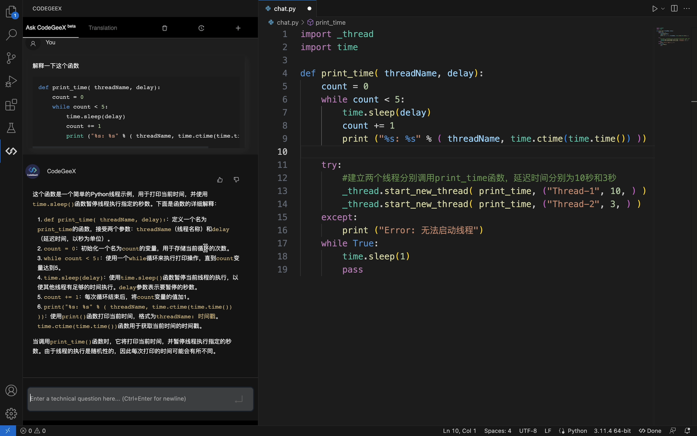

<p align="center">
    🏠 <a href="https://codegeex.cn" target="_blank">ホームページ</a>｜🛠 拡張 <a href="https://marketplace.visualstudio.com/items?itemName=aminer.codegeex" target="_blank">VS Code</a>, <a href="https://plugins.jetbrains.com/plugin/20587-codegeex" target="_blank">Jetbrains</a>｜🤗 <a href="https://huggingface.co/THUDM/codegeex2-6b" target="_blank">HF Repo</a>｜📄 <a href="https://arxiv.org/abs/2303.17568" target="_blank">論文</a>
</p>

<p align="center">
    👋 <a href="https://discord.gg/8gjHdkmAN6" target="_blank">Discord</a> に参加, <a href="https://join.slack.com/t/codegeexworkspace/shared_invite/zt-1s118ffrp-mpKKhQD0tKBmzNZVCyEZLw" target="_blank">Slack</a>, <a href="https://t.me/+IipIayJ32B1jOTg1" target="_blank">Telegram</a>, <a href="resources/wechat.md"target="_blank">WeChat</a>
</p>

查看[中文版](README.md)<br>
Read this in [English](README_EN.md)<br>
Lire en [Français](README_FR.md)

# CodeGeeX2: より強力な多言語コード生成モデル

CodeGeeX2 は、多言語コード生成モデル [CodeGeeX](https://github.com/THUDM/CodeGeeX)([KDD'23](https://arxiv.org/abs/2303.17568)) の第 2 世代モデルであり、より多くのコードデータで学習された [ChatGLM2](https://github.com/THUDM/ChatGLM2-6B) アーキテクチャに基づいて実装されています。ChatGLM2 のアドバンテージにより、CodeGeeX2 のコーディング能力は包括的に向上しています(+107% > CodeGeeX; わずか 6B のパラメータで、いくつかのタスクではより大規模な StarCoder-15B を凌駕しています)。以下の特徴があります:

* **より強力なコーディング機能**: CodeGeeX2-6B は、ChatGLM2-6B モデルをベースに、さらに 600B のコードトークンに対して事前学習を行っており、第一世代と比較してコーディング能力が総合的に向上しています。[HumanEval-X](https://huggingface.co/datasets/THUDM/humaneval-x) ベンチマークでは、6 言語すべてで大幅な改善が見られ（Python +57%、C++ +71%、Java +54%、JavaScript +83%、Go +56%、Rust +321%）、Python では Pass@1 一回合格率 35.9% に達し、より大規模な StarCoder-15B を上回りました。
* **その他の便利な機能**: ChatGLM2-6B モデルの特徴を継承し、CodeGeeX2-6B は中国語と英語のプロンプト、最大 8192 シーケンス長をサポートし、推論速度は第一世代と比較して大幅に改善されています。量子化後、推論に必要な GPU メモリは 6GB のみで、軽量なローカル展開をサポートします。
* **包括的な AI コーディングアシスタント**: CodeGeeX プラグイン（[VS Code](https://marketplace.visualstudio.com/items?itemName=aminer.codegeex)、[Jetbrains](https://plugins.jetbrains.com/plugin/20587-codegeex)）のバックエンドがアップグレードされ、100 以上のプログラミング言語をサポートし、インフィルやクロスファイル補完などの実用的な機能が追加されました。対話型 AI コーディングアシスタント "Ask CodeGeeX" と組み合わせることで、中国語または英語の対話を通じて、コードの要約、コードの翻訳、デバッグ、コメント生成など、さまざまなプログラミング問題を解決することができ、開発者の作業効率を高めることができます。
* **オープンライセンス**: CodeGeeX2-6B ウェイトは学術研究に全面的に開放しています。商用利用をご希望の方は、[登録フォーム](https://open.bigmodel.cn/mla/form?mcode=CodeGeeX2-6B)にご記入の上、お申し込みください。


## AI コーディングアシスタント



VS Code、IntelliJ IDEA、PyCharm、GoLand、WebStorm、Android Studio などの IDE をサポートする CodeGeeX プラグインを開発しました。このプラグインを使用することで、CodeGeeX2 モデルのコード生成と補完、アノテーション、コード変換、"Ask CodeGeeX" 対話型プログラミングなどの機能を体験することができ、開発効率を向上させることができます。より包括的な AI コーディング体験を得るために、IDE に CodeGeeX プラグインをダウンロードしてください。詳しくは[ホームページ](https://codegeex.cn/)をご覧ください。

## 始める

[CodeGeeX2-6B](https://huggingface.co/THUDM/codegeex2-6b) を素早く起動するには、`transformers` を使用します：

```python
from transformers import AutoTokenizer, AutoModel
tokenizer = AutoTokenizer.from_pretrained("THUDM/codegeex2-6b", trust_remote_code=True)
model = AutoModel.from_pretrained("THUDM/codegeex2-6b", trust_remote_code=True, device='cuda')
model = model.eval()

# remember adding a language tag for better performance
prompt = "# language: Python\n# write a bubble sort function\n"
inputs = tokenizer.encode(prompt, return_tensors="pt").to(model.device)
outputs = model.generate(inputs, max_length=256, top_k=1)
response = tokenizer.decode(outputs[0])

>>> print(response)
# language: Python
# write a bubble sort function


def bubble_sort(list):
    for i in range(len(list) - 1):
        for j in range(len(list) - 1):
            if list[j] > list[j + 1]:
                list[j], list[j + 1] = list[j + 1], list[j]
    return list


print(bubble_sort([5, 2, 1, 8, 4]))
```

Gradio DEMO の起動:
```
python ./demo/run_demo.py
```

❗️注意:
* CodeGeeX2 はベースモデルであり、チャット用の命令チューニングはされていません。コード補完/翻訳/説明のようなタスクは可能です。CodeGeeX のプラグイン([VS Code](https://marketplace.visualstudio.com/items?itemName=aminer.codegeex), [Jetbrains](https://plugins.jetbrains.com/plugin/20587-codegeex))で命令チューニングされたバージョンを試すことができます。
* プログラミング言語は、`# language: Python` のように `language tag` を追加することで制御できます。パフォーマンスを確保するため、書式を守る必要があります。完全なリストは[こちら](https://github.com/THUDM/CodeGeeX2/blob/main/evaluation/utils.py#L14)にあります。より良い結果を得るためには、選択したプログラミング言語のフォーマットでコメントを書いてください。
* 複数のグラフィックカードを使用してモデルをロードする必要がある場合は、以下のコードを使用できます：
    ```python
    tokenizer = AutoTokenizer.from_pretrained("THUDM/codegeex2-6b", trust_remote_code=True)
    model = AutoModel.from_pretrained("THUDM/codegeex2-6b", trust_remote_code=True, device='cuda')
    model = model.eval()
    ```
    をに置き換えてください

    ```python
    def get_model():
        tokenizer = AutoTokenizer.from_pretrained("THUDM/codegeex2-6b", trust_remote_code=True)
        from gpus import load_model_on_gpus
        # gpusファイルはdemoフォルダにあります
        model = load_model_on_gpus("THUDM/codegeex2-6b", num_gpus=2)
        model = model.eval()
        return tokenizer, model

    tokenizer, model = get_model()
    ```
## 評価

CodeGeeX2 は多言語コード生成のベースモデルであり、前世代と比較してコーディング能力が大幅に向上しています。HumanEval、HumanEval-X、DS1000 ベンチマークでの評価結果を以下に示します（評価指標 Pass@k は[論文](https://arxiv.org/abs/2303.17568)と同じです）:

### HumanEval (Pass@1,10,100)

| **Model**           | **Pass@1** | **Pass@10** | **Pass@100** |
| :-----------------: | :--------: | :---------: | :----------: |
| CodeGen-16B-multi   | 19\.2      | 34\.6       | 55\.2        |
| CodeGeeX-13B        | 22\.9      | 39\.6       | 60\.9        |
| Codex-12B           | 28\.8      | 46\.8       | 72\.3        |
| CodeT5Plus-16B-mono | 30\.9      | 51\.6       | 76\.7        |
| Code-Cushman-001    | 33\.5      | 54\.3       | 77\.4        |
| LLaMA-65B           | 23\.7      | -           | 79\.3        |
| LLaMA2-70B          | 29\.9      | -           | -            |
| CodeGen2\.5-7B-mono | 33\.4      | 58\.4       | 82\.7        |
| StarCoder-15B       | 33\.2      | 61\.0       | 84\.7        |
| **CodeGeeX2-6B**    | **35\.9**  | **62\.6**   | **88\.3**    |
> **Pass@1** 使用 `n=20, t=0.2, top_p=0.95`; **Pass@10** および **Pass@100** を使用 `n=200, t=0.8, top_p=0.95`。

### HumanEval-X (Pass@1)

| **Model**                | **Python** | **C++**   | **Java**  | **JavaScript** | **Go**    | **Rust**  | **Overall** |
| :------------------: | :--------: | :-------: | :-------: | :------------: | :-------: | :-------: | :---------: |
| CodeGen-16B-multi    | 19\.2      | 18\.1     | 15\.0     | 18\.4          | 13\.0     | 1\.8      | 14\.2       |
| CodeGeeX-13B         | 22\.9      | 17\.1     | 20\.0     | 17\.6          | 14\.4     | 4\.3      | 16\.0       |
| Replit-code-v1-3B    | 22\.0      | 20\.1     | 20\.1     | 20\.1          | 12\.2     | 8\.6      | 17\.2       |
| CodeGen2\.5-7B-multi | 30\.6      | 24\.3     | 29\.0     | 27\.5          | 18\.9     | **20\.1** | 25\.1       |
| StarCoder-15B        | 35\.5      | 28\.2     | **31\.5** | **33\.2**      | 21\.3     | 17\.8     | 27\.9       |
| **CodeGeeX2-6B**         | **35\.9**  | **29\.3** | 30\.8     | 32\.2          | **22\.5** | 18\.1     | **28\.1**   |
> **Pass@1** 使用 `n=20, t=0.2, top_p=0.95`。

上記の結果は `scripts/run_humanevalx.sh` を実行することで再現できる。実験の設定は [HumanEval-X 環境](https://github.com/THUDM/CodeGeeX/blob/main/codegeex/benchmark/README_zh.md)を参照してください。

### DS1000 (Pass@1)

| **Model**            | **Matplotlib** | **Numpy** | **Pandas** | **Pytorch** | **SciPy** | **Scikit-learn** | **TensorFlow** | **Overall** |
| :--------------: | :------------: | :-------: | :--------: | :---------: | :-------: | :--------------: | :------------: | :---------: |
| \# Samples       | 155            | 220       | 291        | 68          | 106       | 115              | 45             | 1000        |
| CodeGen-16B-Mono | 31\.7          | 10\.9     | 3\.4       | 7\.0        | 9\.0      | 10\.8            | 15\.2          | 11\.7       |
| code-cushman-001 | 40\.7          | 21\.8     | 7\.9       | 12\.4       | 11\.3     | 18\.0            | 12\.2          | 18\.1       |
| Codex-001        | 41\.8          | 26\.6     | 9\.4       | 9\.7        | 15\.0     | 18\.5            | 17\.2          | 20\.2       |
| **CodeGeeX2-6B** | 40\.5          | 25\.5     | 14\.5      | 17\.3       | 19\.3     | 24\.0            | 23\.0          | 23\.1       |
| StarCoder-15B    | 51\.7          | 29\.7     | 11\.4      | 21\.4       | 20\.2     | 29\.5            | 24\.5          | 26\.0       |
| Codex-002        | **57\.0**      | **43\.1** | **26\.5**  | **41\.8**   | **31\.8** | **44\.8**        | **39\.3**      | **39\.2**   |
> **Pass@1** 使用 `n=40, t=0.2, top_p=0.5`。

上記の結果は [DS1000 repo](https://github.com/HKUNLP/DS-1000.git) のコードで再現できる。

## 推論

CodeGeeX2 は、前世代よりも導入が容易になりました。マルチクエリーアテンションとフラッシュアテンションの使用により、推論速度が速くなり、INT4 量子化後に必要な GPU メモリは 6GB のみです。

### 量子化

| **Model**        | FP16/BF16 | INT8    | INT4   |
| :--------------: | :-------: | :-----: | :----: |
| CodeGeeX-13B     | 26\.9 GB   | 14\.7 GB | -      |
| **CodeGeeX2-6B** | 13\.1 GB  | 8\.2 GB  | 5\.5 GB |
> PyTorch 2.0に基づき、`torch.nn.functional.scaled_dot_product_attention` を使用して、効率的なアテンションメカニズムを実現。

### 加速

| **Model**        | **推論速度 (token/秒)** |
| :--------------: | :-------------: |
| CodeGeeX-13B     | 32              |
| **CodeGeeX2-6B** | 94              |
> `batch_size=1, max_length=2048`, どちらもアクセラレーションフレームワークを使用、`GeForce RTX-3090` の場合。

## ライセンス

このリポジトリのコードは、[Apache-2.0](https://www.apache.org/licenses/LICENSE-2.0) ライセンスの下でのオープンソースです。モデルのウェイトは [Model License](MODEL_LICENSE) に基づいてライセンスされています。CodeGeeX2-6B のウェイトは学術研究用に公開されています。商用利用を希望される方は、[登録フォーム](https://open.bigmodel.cn/mla/form?mcode=CodeGeeX2-6B)にご記入の上、お申し込みください。


## 引用

私たちの研究がお役に立ちましたら、ぜひ以下の論文を引用してください:

```
@inproceedings{zheng2023codegeex,
      title={CodeGeeX: A Pre-Trained Model for Code Generation with Multilingual Evaluations on HumanEval-X},
      author={Qinkai Zheng and Xiao Xia and Xu Zou and Yuxiao Dong and Shan Wang and Yufei Xue and Zihan Wang and Lei Shen and Andi Wang and Yang Li and Teng Su and Zhilin Yang and Jie Tang},
      booktitle={KDD},
      year={2023}
}
```
